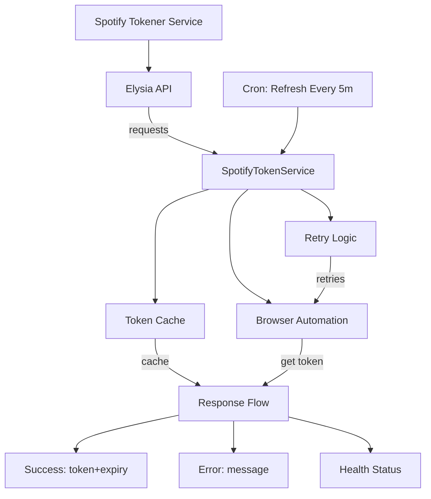

# Spotify Tokener

> **Fast & Reliable Spotify Access Token Generator for LavaSrc**

A high-performance REST API that generates and caches anonymous Spotify access tokens using Playwright automation. Designed for seamless integration with LavaSrc/Lavalink but works with any service requiring Spotify tokens.

## ✨ Features

- **🚀 Fast Token Generation** - Optimized Chromium automation with Playwright
- **💾 Smart Caching** - 5-minute buffer with proactive 10-minute refresh
- **🔒 Concurrency Safe** - Semaphore-protected with wait queue for concurrent requests
- **⚡ High Performance** - Built with Elysia framework for ultra-fast responses
- **🎯 LavaSrc Ready** - Drop-in replacement for anonymous token endpoints
- **📝 TypeScript** - Fully typed, modular architecture with strict validation
- **🔄 Auto-Refresh** - Cron job runs every 5 minutes for proactive token refresh
- **🛡️ Error Resilience** - 3-retry logic with exponential backoff (1s→2s→4s)
- **📊 Health Monitoring** - Real-time status endpoint with memory usage
- **🔍 Built-in Swagger** - Interactive API documentation at `/swagger`

## 🚀 Quick Start

### Installation
```bash
# Clone & install
git clone https://github.com/appujet/spotify-tokener.git
cd spotify-tokener
bun install

# Install Playwright browsers
npx playwright install
```

### Usage
```bash
# Start server (default: port 3000)
bun run start

# API docs available at: http://localhost:3000/swagger
```

## 🔧 LavaSrc Integration

```yaml
spotify:
  preferAnonymousToken: true
  customAnonymousTokenEndpoint: "http://localhost:3000/api/token"
```

## 📡 API Reference

### `GET /api/token`
**Generate/retrieve Spotify access token**

**Query Parameters:**
- `force` *(optional)* - Force refresh: `1`, `true`, or `yes`

**Success Response (200):**
```json
{
  "success": true,
  "accessToken": "BQC7...",
  "accessTokenExpirationTimestampMs": 1678886400000,
  "clientId": "3a0ed...",
  "isAnonymous": false,
  "cached": false,
  "timestamp": 1678886300000
}
```

**Error Response (500):**
```json
{
  "success": false,
  "error": "Token generation failed",
  "timestamp": 1678886300000
}
```

### `GET /api/token/status`
**Check token service status**

**Success Response (200):**
```json
{
  "success": true,
  "status": {
    "hasToken": true,
    "isValid": true,
    "shouldProactivelyRefresh": false,
    "expiresAt": 1678886400000,
    "isRefreshing": false,
    "timeUntilExpiry": 100000,
    "timeUntilProactiveRefresh": 40000
  },
  "timestamp": 1678886300000
}
```

### `POST /api/token/refresh`
**Force token refresh**

**Success Response (200):**
```json
{
  "success": true,
  "accessToken": "BQC7...",
  "accessTokenExpirationTimestampMs": 1678886400000,
  "clientId": "3a0ed...",
  "isAnonymous": false,
  "cached": false,
  "timestamp": 1678886300000
}
```

### `GET /health`
**Service health check**

**Success Response (200):**
```json
{
  "status": "healthy",
  "uptime": 3600,
  "memory": {
    "rss": 45678592,
    "heapTotal": 30212096,
    "heapUsed": 23456789
  },
  "timestamp": 1678886300000
}
```

### Error Responses
- **400 Validation Error:** `{"error": "Validation error", "details": "Invalid request", "timestamp": 1678886300000}`
- **404 Not Found:** `{"error": "Endpoint not found", "timestamp": 1678886300000}`
- **500 Internal Error:** `{"error": "Internal server error", "timestamp": 1678886300000}`

## 🆚 Comparison with Accessify

| Feature | Spotify Tokener | Accessify |
|---------|----------------|-----------|
| **Framework** | Elysia (Ultra-fast) | Hono |
| **Runtime** | Bun (Faster) | Node.js 18+ |
| **Setup** | Simple `bun install` | Manual Chromium setup |
| **Deployment** | Auto Playwright install | Complex Pterodactyl config |
| **API Docs** | Built-in Swagger | Basic REST only |
| **Token Status** | Advanced monitoring | Basic endpoint |
| **Caching** | Smart auto-refresh | Basic caching |

### 🏗️ Architecture Overview



### 🔄 Data Flow

1. **Request** → Elysia API receives request
2. **Middleware** → Logging, validation, error handling
3. **Service** → SpotifyTokenService checks cache
4. **Cache Hit** → Return cached token (if valid)
5. **Cache Miss** → Launch Chromium browser
6. **Automation** → Navigate to Spotify, intercept token
7. **Retry Logic** → 3 attempts with exponential backoff
8. **Cache Update** → Store new token with expiration
9. **Response** → Return JSON with token data
10. **Cron Job** → Proactive refresh every 5 minutes

## 🛠️ Development

### Prerequisites
- **Bun** - JavaScript runtime ([install](https://bun.sh))
- **Playwright** - Browser automation

### Environment Setup
```bash
# Development mode
bun run dev

# Production build
bun run start
```


## 🔍 Troubleshooting

**Common Issues:**
- **Playwright install fails:** Run `npx playwright install chromium --force`
- **Token generation slow:** Check browser automation setup
- **Cache not working:** Verify memory limits and concurrency settings

**Performance Tips:**
- Use `force=1` sparingly to avoid rate limits
- Monitor `/api/token/status` for proactive refresh timing
- Scale horizontally for high-traffic scenarios

## 📄 License

MIT License - See [LICENSE](LICENSE) file for details.

---

**Need help?** Open an issue on [GitHub](https://github.com/appujet/spotify-tokener/issues) or check the [Wiki](https://github.com/appujet/spotify-tokener/wiki) for detailed guides.