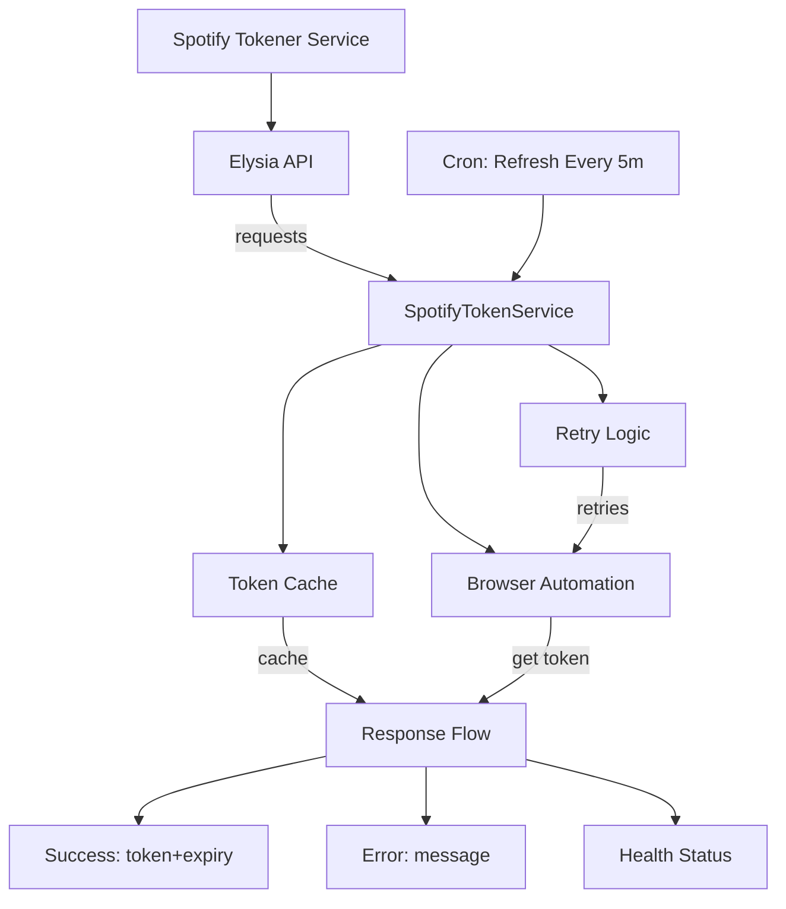

Here's a compact version of your Spotify Tokener documentation:

# Spotify Tokener

Fast Spotify access token generator for LavaSrc with caching.

## Features
- 🚀 Fast Playwright-based token generation
- ⚡ High-performance Elysia API
- 🔄 Auto-refresh
- 🛡️ Error resilience with retries

## Quick Start
```bash
git clone https://github.com/appujet/spotify-tokener.git
cd spotify-tokener
bun install
npx playwright install
bun run start
```

## API Endpoints
- `GET /api/token` - Get token (`?force=1` to refresh)
- `GET /health` - Service health

## LavaSrc Config
```yaml
spotify:
  preferAnonymousToken: true
  customAnonymousTokenEndpoint: "http://yourserver/api/token"
```

## Response Format
```json
{
  "success": true,
  "accessToken": "BQC7...",
  "accessTokenExpirationTimestampMs": 1678886400000,
  "clientId": "3a0ed...",
  "isAnonymous": false,
  "cached": false,
  "timestamp": 1678886300000
}
```

## 🛠️ Development

### Prerequisites
- **Bun** - JavaScript runtime ([install](https://bun.sh))
- **Playwright** - Browser automation

### Environment Setup
```bash
# Development mode
bun run dev

# Production build
bun run start
```

### 🏗️ Architecture Overview




## 🔍 Troubleshooting

**Common Issues:**
- **Playwright install fails:** Run `npx playwright install chromium --force`
- **Token generation slow:** Check browser automation setup
- **Cache not working:** Verify memory limits and concurrency settings

**Performance Tips:**
- Use `force=1` sparingly to avoid rate limits
- Monitor `/api/token/status` for proactive refresh timing
- Scale horizontally for high-traffic scenarios

---

**Need help?** Open an issue on [GitHub](https://github.com/appujet/spotify-tokener/issues) or check the [Wiki](https://github.com/appujet/spotify-tokener/wiki) for detailed guides.